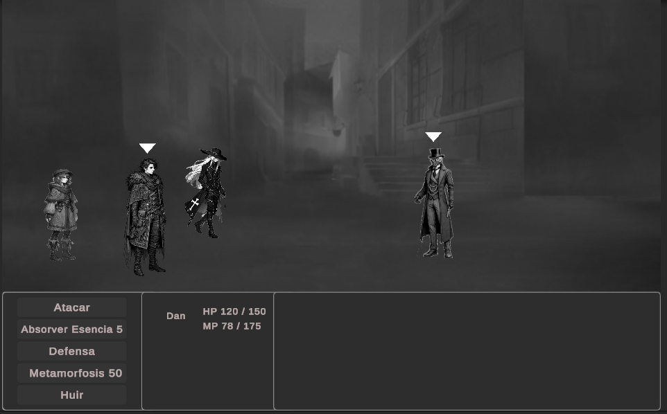
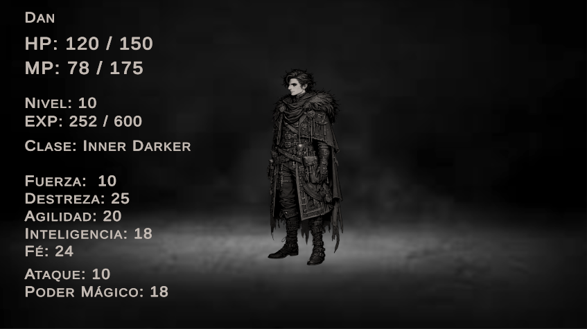
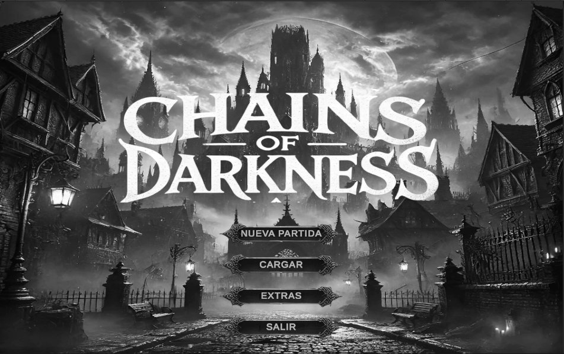

# Índice

1. [Introducción](#introducción)
2. [Historia y Narrativa](#historia-y-narrativa)
3. [Mecánicas del Juego](#mecánicas-del-juego)
4. [Jugabilidad y Progresión](#jugabilidad-y-progresión)
5. [Personajes](#arte-y-estilo-visual)
6. [Clases de Personajes ](#clases-de-personajes)
7. [Interfaz y Experiencia de Usuario (UI/UX)](#interfaz-y-experiencia-de-usuario-uix)
8. [Aspectos Técnicos](#aspectos-técnicos)
9. [Estilo Visual](#arte-y-estilo-visual)
10. [Conclusión](#Conclusión)

## 1. Introducción  
*Chains of Darkness* es un RPG de terror en 3D ambientado en un mundo abierto del siglo XIX, donde la alquimia, la magia y la tecnología coexisten en un frágil equilibrio. El jugador asume el papel de un cazador que busca venganza y respuestas en un mundo rodeado de oscuridad y asediado por monstruos y entidades demoníacas.  

---

## 2. Historia y Narrativa  

El protagonista es un joven cuyo pueblo donde viven, crian, adiestran exterminadores de monstruos destruida por un ejercito de criaturas de pesadillas encabezada por su propio padre un cazador de demonios reconocido, que fue poseído por un poderosa entidad maligna, para la cúal fue enviado a derrotar y que tras ser destruido su cuerpo físico, oculto su esencia dentro de él,para fingir su propia derrota y destruirlos a todos tras un supuesto regreso triunfante a su hogar.

Esa noche, el protagonista despertó repentinamente esa noche y tuvo que ver para su horror como su padre masacraba a su familia y abría un portal de invocación del cual surgio un ejercito de criaturas de pesadilla, que masacró a hombres, mujeres y niños que no tuvieron oportunidad de oponerse o oponer resistencia que frente a un ataque inesperado de semejante magnitud.

Fue salvado por Kargh el mejor amigo de su padre, que lo ayudo a escapar a costa de su propio sacrificio.

Este evento trágico fue nombrado por el mundo como la noche de walpurgis. Desde la extinción de este pueblo los monstruos, debido a la ausencia de individuos preparados para hacerles frente, un aumento masivo de criaturas, sucesos paranormales y actividad demoniaca comenzaron a azotar al mundo.

Han pasado varios años, actualmente el protagonista se encuentra bajo la tutela y es el discípulo de Solomon Hammerheight, un demonólogo y exorcista que recorre y se encarga de realizar misiones de investigar y erradicar toda actividad maligna que llegan a sus oídos ya sea a través de leyendas, historias, rumores de lugareños o órdenes directas del vaticano.

---

## 3. Mecánicas del Juego  

- **Exploración**: Mundo semiabierto con ciudades, pueblos, ruinas, bosques, cavernas, zonas infestadas de enemigos,etc.
- **Combate por Turnos**: Sistema clásico con ataques, habilidades y defensa.  
- **Misiones**: Misiones basada en encargos, rumores de hogareños, reportes, leyendas o órdenes directas del Vaticano. La historia principal  y secundarias en ocasiones tendrán toma de decisiones, que influirán en el destino de los          personajes, el final y obtener ciertos personajes ocultos.
- **Sistema de Transformaciones (*Inner Darker*) y especialización de clases.**  

### Acciones Básicas en Combate:
- **Atacar**: Golpe básico que escala con la fuerza.  
- **Habilidades de Clase**: Dependen de la clase o transformación activa.  
- **Defensa**: Reduce el daño recibido en el próximo turno.  
- **Huir**: Posibilidad de escapar de un combate.  

  

---

## 4. Jugabilidad y Progresión  

- **Subida de Nivel**: Derrotar enemigos otorga experiencia y mejora estadísticas.  
- **Cambio de Clase**: Cada personaje tiene dos clases que puede alternar fuera de combate.  
- **Transformaciones (*Inner Darker*)**: Absorción de esencias de enemigos para desbloquear cambios de forma.  

### Estadísticas:  
- **Fuerza** → Aumenta daño físico.  
- **Destreza** → Afecta precisión y velocidad de ataque.  
- **Agilidad** → Influye en la probabilidad de esquivar.  
- **Vitalidad** → Determina la cantidad de vida.  
- **Maná** → Determina la cantidad de maná disponible.  
- **Inteligencia** → Aumenta el daño de habilidades mágicas y maná maximo (en mucha menor medida que la fé). 
- **Fé** → Aumenta el daño de habilidades mágicas y maná máximo. 

 
---

## 5. Personajes

**Protagonista** (Nombre y apariencia personalizable). Superviviente de la masacre de los exterminadores de demonios. De carácter humanitario y en ocasiones demasiado inocente,
posee un poder latente dentro de él. Actualmente discipulo de Solomon, contrasta en ocasiones con su naturaleza despiada e impasible. 
Busca erradicar el mal y evitar que la gente inocente sufra. 

Sin darse cuenta, él y su grupo se verán envueltos en una serie de sucesos aparentemente sin relación alguna, que llevaran a un enfrentamiento que no solo 
determinarán el destino de la humanidad sino de él mismo.

**Solomon**. Actualmente exorcista y demonólogo, oculta un pasado oscuro. De carácter aparentemente cínico y frío, este poderoso exorcista fue hace años 
fue un reconocido corsario por su codicia y sed de sangre. 

Durante el saqueo a colonia portuaria, durante el asalto al ayuntamiento para extorsionar bajo amenaza de muerte al gobernador de esta a cambio de riqueza, llego solo 
para presenciar la muerte de este y como una entidad llamada reaper declaraba haber sido invocada por un enemigo común para llevarse su alma y la de Solomon 
como consecuencia de un pacto demoníaco.

Tras esto, en un acto de arrogancia, junto a su tripulación solo para ver como estos eran asesinados, logrando huír. 

En un intento de redimirse y evitar ser cazado por esta Criatura, se refugio en la fé y la magia sagrada y a pesar de las constantes 
discrepancias actualmente sirve al Vaticano.

A pesar de poder ocultarse mediante magia,mientras siga vivo, el reaper seguirá persiguiendolo hasta que cumpla su parte de eliminarlo.

**Dan**. Se trata de uno de miembros de la perseguida raza InnerDarker, seres humanos capaces de transformarse en la representación física de su oscuridad interior,
tomando la forma de criaturas y bestias abominables, que a lo largo de la historia han sido cazados al borde de la extinción y odiados tanto por humanos como por criaturas.

De cáracter protector y reservado, busca vivir en el anonimato, mientras protege lo que actualmente llama su hogar, de los recientes ataques de criaturas.

Al igual que la mayoría de su raza, vive en un constante tira y afloja luchando contra su oscuridad interior para que su propio poder no lo consuma y lo lleve a convertirse permanentemente en una criatura sedienta de sangre,
sin raciocinio y cordura alguna.

**Lynn**. Joven huérfana de padres que a edad temprana descubrió que posee el inusual don de la magia de forma innata. Estos se manisfestaron como facultades curativas. De carácter compasiva y amable, escapó del orfanato y siempre está viajando de una lado a otro, usando sus poderes curativos, para sanar a los necesitados, siendo considerados estos por la gente común como milagros. Durante sus viajes se ha ganado el sobrenombre de la "Adepta de la Luz".

 

**Serge**. Joven aventurero que vive en Ravensholl junto a su hermana más pequeña Rina. Cuando un misterioso culto de carácter sectario se asentó en esa ciudad, convirtiendose en la máxima autoridad y recientemente con su hermana siendo captada como futuro miembro antes de desaparecer misteriosamente...Planea infiltrarse en su abadía para encontrar a su hermana y llevarla de vuelta a casa.

**Azaret**.(Personaje Oculto) Poderoso mago oscuro inmortal y falta de ética que demuestra un carácter arrogante, cortante y analitico pero práctico. 

Pese a ser una fuerza del mal, si conviene a sus objetivos o para garantizar su propia supervivencia no dudará ni un segundo en traicionar o cambiarse de bando.

Siendo en su día un alumno prometedor ha llevado gran parte de su vida al estudio de la magia y todas sus ramas, pero su sed de conocimiento y poder lo llevo a ir un paso más allá y comenzar a introducirse poco a poco en ramas de la magia profana o prohibida, para lo cúal realizo toda clase de actos deplorables, como pactar con demonios o realizar sacrificios, entre otros actos inombrables para satisfacerlos a cambio de más poder y conocimiento.

---

## 6. Clases de Personajes  

Cada personaje puede desbloquear una segunda clase, cambiando sus habilidades, estadísticas y mecánicas de combate. 

### El protagonista a diferencia de los otros personajes tiene 3 clases: **Aprendiz / Exterminador de Monstruos / Guerrero**   
- **Aprendiz**: Clase inicial del protagonista que esta equilibrada en magia y combate. Es un lienzo en blanco, puede usar magia ofensiva, sagrada y ataques fisicos, etc pero sus habilidades nunca serán tan poderosas o avanzadas como las de otras clases.
- **Exterminador de Monstruos**: Esta clase es poderosa en ataques físicos y capaz de usar diferentes tipos de magia ofensiva a un nivel avanzado. A diferencia de otras clases puede emplear mayor variedad de armas, que van desde espadas de dos manos, ballestas, shurizen gigantes hasta látigos. 
- **Guerrero**: Los guerreros son maestros en el cuerpo a cuerpo y ser autenticas murallas o atacantes físicos dependiendo del equipamiento que lleven.

- **Aprendiz**: 
#### Aprendiz – Bola de Fuego
- Canalizas levemente los elementos para invocar una bola de fuego que impacta en el enemigo.
- Inflige un daño leve/medio al enemigo.
- Tiene un bajo coste y se aprende a niveles tempranos.

- **Exterminador de Demonios**: 
#### Exterminador de demonios – Grand Cross Sword
- Imbuyes de magia sagrada tu espada antes de realizar un golpe rápido y preciso con ella, realizando daño fisico y mágico de elemento sagrado.
- Inflige daños masivos al enemigo.
- Daño aumentado a demonios.

- **Guerrero**: 
#### Guerrero – Rompecorazas
- Realizas un ataque potente en el punto débil del enemigo aumentando su daño recibido por ataques físicos un 40% durante 3 turnos. 
- Inflige un daño respetable al objetivo por un bajo coste de maná.
- Ideal para una composición de atacantes físicos.

--- 

### Solomon posee estas dos clases: **Exorcista / Corsario** 
- **Exorcista**: Utiliza la magia sanadora y sagrada, támbien utiliza disparos con pistolas ímbuidos de magia con diferentes efectos.  
- **Corsario**: Combatiente sediento de sangre  y experto en el combate con sables y pistolas. A diferencia de otras clases, sus ataques exigen un costo de vida en lugar de maná.

#### Exorcista – Disparo de Fé  
- Canalizas el poder sagrado para bendecir las balas de tu arma con magia y realizar un potente ataque disparando a tu enemigo
- Este ataque reduce durante 2 turnos la resistencia a los enemigos a los ataques de elemento sagrado. 
- Tiene un alto coste de maná.

#### Corsario – Codicia Sangrienta
- Realizas un impactante combo con tus dos sables apuñalando e inmobilizando al enemigo con uno mientras que con el otro atraviesas su corazón múltiples veces con estocadas. 
- Este ataque tiene robo de vida
- Inflige más daño en enemigos con menos del 30% de vida.

---

### Dan puede ser: **Inner Darker / Berserker**  
- **Inner Darker**: Capaz de absorber la esencia de enemigos y transformarse en ellos. Al inicio es una clase débil, pero se vuelve extremadamente versátil  y poderosa a medida que desbloqueas un amplio pool de enemigos en los que transformarte.
- **Berserker**: Te transformas en una bestia abominable cuyo daño es masivo pero recibe el doble de daño, y si se abusa mucho de sus habilidades ofensivas pierdes el control del personaje pudiendo llegar incluso a atacar a sus compañeros.  

#### InnerDarker – Absorción de Esencia  
- Usar la habilidad de absorver esencia tiene una probabilidad de un 5% de otorgar su esencia que irá aumentando progresivamente con el uso continuado en combate hasta un 100% de obtenerla.  
- Cada esencia desbloquea una transformación permanente.  
- Se pueden equipar hasta **tres transformaciones activas**.  

#### Algunas Transformaciones:  
1. **Espectro Sombrío** – Te transformas en un ser fantasmal que te permite recibir un daño reducido de ataques fisicos, meter maldiciones (debuffos) y realizar ataques de mágia oscura.  
2. **Demonio Carroñero** – Criatura cuadrúpeda que inflinje ataques de sangrados en los enemigos y cada vez que muere un enemigo puede devorar su cádaver para recuperar o aumentar su daño.  
3. **Bestia Abismal** – Demonio con un hacha enorme que infligen potentes ataques físicos y daño de fuego.
4. **Titán de Hueso** – Criatura enorme orientada a la defensa, puede inflingir daño en área a todos los enemigos y atrae los ataques hacia él .  
5. **Engendro del Caos** – La transformación propia de Dan, capaz de infligir potente daños físicos, sangrados y potenciarse drásticamente a través de magia negra.  

#### Berserker – Machaque colosal:  
-Realizas un ataque brutal que inflinge daño físico masivo pero con cada uso tienes una probabilidad del 25% de perder completamente el control del personaje, que irá aumentando con cada uso. 
-Recibes el doble de daño de todas las fuentes
 
---

### Serge puede ser **Ladrón / Espadachín** 
- **Ladrón**: Experto en sigilo, evasión y ataques rápidos. Tambíen robar objeto, meter debuffos y aportar utilidad.
- **Espadachín**: Poderoso combatiente en el uso de la espada. Emplea movimientos precisos y ágiles para abrumar a sus enemigos.

#### Ladrón – Desvanecimiento
- Lanzas una bomba de humo a tus pies o a los de un aliado, haciendolo invisible por un turno y que un enemigo no pueda escogerlo como objetivo de un ataque.
- Tiene un alto coste de maná
- Se aprende a niveles tárdios.

#### Espadachín – Santo de la Espada
- Ataque extremadamente ágil y rápido que inflinje mucho daño físico a través de una combinación de estocadas.
- Tras usarse permite esquivar y realizar un contraataque cada vez que es golpeado por un ataque físico del enemigo durante un turno.
- Tambíen funciona con magia que inflinja daño físico.

---

### Lynn puede ser: **Curandera / Hechicera**  
- **Curandera**: Utiliza habilidades de sanación y apoyo.
- **Hechicera**: Poderosa usuaria innata del uso de la magia, capaz de canalizar el poder de los elementos.

#### Curandera – Sacrificio Altruista
- En un acto de desesperación canaliza e invoca el poder de la luz para sanar y restaurar completamente la vida y el maná del resto del grupo, a costa de su propia vida.
- Solo se puede usar una vez por combate.
- Tras ser usado el/la curandera no podrá ser resucitada durante el resto del combate.

#### Hechicera – Piroclasto
- Ataque mágico de alto nivel que crea y concentra fuego y lava a los pies del enemigo provocando una explosión que inflije daño de atributo fuego.
- Tiene un 10% de probabilidades de quemar al enemigo, con lo cúal perderá vida a lo largo de 2 turnos
- Es el hechizo de elemento fuego más poderoso del juego.

---

### Azaret el único personaje opcional en base a las decisiones que tomes en el juego puede ser: **Brujo / Mago**  
- **Brujo**: Utiliza maldiciones y hechizos de magia oscura del nivel más alto. Tambien aporta utilidad pero a costa de un alto precio.   
- **Mago**: Versátil usuario de magia con un repertorio de conjuros ofensivos y defensivos.  

#### Brujo – Sacrificio Pactado
- En brujo realiza un pacto ímpio con fuerzas oscuras y un aliado para hacer que este personaje sea totalmente invulnerable durante 2 turno pero irremediablemente morirá después
- No puede combinarse para evitar la muerte de un aliado que utilice Sacrificio Altruista.

#### Mago – Supernova Arcana
- Ataque mágico de alto nivel que crea y concentra energía arcana de forma masiva en una esfera que al lanzarse provoca un daño arcano masivo a todos los enemigos.
- Este ataque inflinje daño arcano aumentado en función de maná usado en ese momento.
- Concentra y consume todo el maná del personaje en el ataque dejandolo a 0.

---

## 7.Interfaz y Experiencia de Usuario (UI/UX)
Es juego tiene un menú inicial que permite iniciar nueva partida, cargar partida, controles y salir del juego.

Dentro del juego tienes un menú similar pero con la opción de guardar.

---

## 8.Aspectos Técnicos
Este Juego para plataformas de PC, en idioma Español.Es en resolución Full HD (1929x1080).

---

## 9.Estilo Visual
En cuanto a ambientacíon, intenta abarcar una estética de fantasía oscura mientras conserva tintes de juegos final fantasy. El uso de una paleta de colores oscuros, tristes busca crear un ambiente oscuro y melancólico, evocando sensaciones de misterio y decadencia de un mundo devastado por demonios y criaturas.

---

## 10.Conclusiom

Chains of Darkness es una experiencia RPG inmersiva que combina una narrativa profunda y oscura con un sistema de combate estratégico basado en turnos. A través de su historia cargada de tragedia, venganza y redención, los jugadores explorarán un mundo asediado por fuerzas malignas, enfrentando decisiones que afectarán el destino de los personajes y del propio mundo.

Con una amplia variedad de clases, transformaciones y mecánicas de progresión, el juego ofrece una jugabilidad rica y personalizable que se adapta a diferentes estilos de juego. Su estética de fantasía oscura, inspirada en mitos y leyendas del terror gótico, junto con su banda sonora y ambientación, refuerzan la sensación de un mundo en decadencia, lleno de peligro e intriga.

En definitiva, Chains of Darkness es más que un juego de rol; es una historia de lucha contra la oscuridad, tanto externa como interna, donde cada decisión puede acabar determinando el destino de la humanidad como se puede ver reflejado en los diferentes finales que puedes obtener de acuerdo a determinadas decisiones aparentemente irrelevantes a lo largo del juego.

